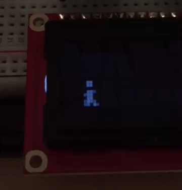

<p align="center">
	 
</p>

[](https://github.com/ellerbrock/open-source-badge/)

[](https://codeclimate.com/github/brain-labs/brainstation/)
[](https://codeclimate.com/github/brain-labs/brainstation)
[](https://coveralls.io/github/boennemann/badges?branch=master)
[](https://david-dm.org/boennemann/badges)
[](https://opensource.org/licenses/GPL-3.0/)

# BrainStation
> Perhaps the smallest full-working video game console for Arduino based on the NES Emulator and the project [`jamulator`](https://github.com/andrewrk/jamulator). It is also a proof of concept for the [Brainduino interpreter](https://github.com/brain-labs/brainduino), an interpreter of the [Brain Language](https://github.com/brain-labs/brain) targetting Arduino.

# 

- [Proof of Concept](#proof-of-concept)
- [Status](#status)
- [Installation](#installation)
- [TODO](#todo)
- [How it works](#how-it-works)
  - [Control Cells](#control-cells)
  - [Custom Cells](#custom-cells)
  - [Cells Reserved to Object 1](#object-1-cells)
  - [Cells Reserved to Object 2](#object-2-cells)
- [Help](#help)
- [License](#license)

### Proof of Concept

<p align="center">
        
</p>

- __Human Jump__ _// Avoiding obstacles by controlling a character through Bluetooth on an iPhone_

- Game:

<p align="center">
        
</p>

- Code:

```Brainfuck
setup
>>>>>>>?:++; make the count of two sprites at cell 7
build values for distant cells so we can jump later
>?<<<<<:++++++++>+*>+*>+++++++*<--*<---*<<<<<<;

?->>>>>>^>>>+<<<<^:<<; if btn DOWN is pressed increment Y position of human object
?->>>>>>>>^>>>-<<<<^; if btn UP is pressed decrement Y position of human object

player
>>>>>>>>^?:++; write the number two if cell 41 is empty
<<?:++++++;>> go to cell 38 and make it 6 if it is empty
>+% increment cell 42 and take it mod 2 because so we can change the sprite
<<?:+;^ go back to cell 1

monster 1
>>>>>>>>>^?:++; go to cell 48 and make number two if cell 48 is empty
>+%++ increment cell 49 and take it mod 2 and add 2 so we can change its sprite
>?--:++>_%<++++++++++++; if cell 16 is equal to 0 then we reset it to the number 15

?: check if cell 50 is equal to zero
   > go to cell 51 in case it is
   ? check if 51 is different from zero
     <<<<<<<< go to cell 43 in case it is
     ?<<<<<^?:+;; if cell 43 different from zero then the game is over
   : if cell 51 equal to zero
     <<<<<<<< go to cell 43
     ?:<<<<<^?:+;; if cell equal to zero then the game is over
   ; 
;
```

### Status
Brainduino is currently in development mode, please check the [dev branch](https://github.com/brain-labs/brainstation/tree/dev)

| To Do | In Progress | Done  |
| :---: | :---------: | :---: |
||)||
||||
|||)|

### Installation
You may install `BrainStation` by following the instructions given here: [https://github.com/brain-labs/brainduino](https://github.com/brain-labs/brainduino)

### How BrainStation works
BrainStation is based on old video game consoles such as NES and SNES and has its own PPU (Picture Processing Unit). That being said, its code will be executed by following a sequence of steps:

- 1. Check for external user input and set the `cells 0 trough 5`, if they are active (see [Control Cells](#control-cells)).
- 2. Run the Brainduino as the CPU cycle (setting the values of the fields and running the `Brain` script code).
- 3. Run the BrainStation as the PPU cycle (drawing the elements on the LCD).

The BrainStation uses the Brainduino cells (__100 cells__ because of the Arduino __limitation__) as its _Turing Tape_ and has this format:

#### Control Cells

|   LEFT BTN   |   UP BTN    |  RIGHT BTN  |   DOWN BTN  |    A BTN    |     B BTN   |  IsGameOver | N Sprites  |
| :----------: | :---------: | :---------: | :---------: | :---------: | :---------: | :---------: | :--------: |
|   Cell 0     |   Cell 1    |   Cell 2    |    Cell 3   |    Cell 4   |     Cell 5  |    Cell 6   |   Cell 7   |

- `Cell 0`: Left Button
- `Cell 1`: Up Button
- `Cell 2`: Right Button
- `Cell 3`: Down Button
- `Cell 4`: A Button
- `Cell 5`: B Button
- `Cell 6`: IsGameOver? (__0: false__, __1: true__)
- `Cell 7`: NSprites (Number of objects shown at same time on LCD)

#### Custom Cells

|  Custom  |  Custom  |  Custom  |  Custom  |  Custom  |  Custom  |  Custom  |  Custom     |    Custom   |   Custom   |
| :------: | :------: | :------: | :------: | :------: | :------: | :------: | :---------: | :---------: | :--------: |
| Cell 8   | Cell 9   | Cell 10  |   ...    |   ...    |    ...   |    ...   |  Cell 33    | Cell 34     |   Cell 35  |

- `Cells 8 through 35`: Custom Cells (You can use them for any kind of operations)

#### Object 1 Cells

| Custom Obj1 | Custom Obj1 | Custom Obj1 | Custom Obj1 | Custom Obj1 | Obj1 #Sprite |  Obj1 #X Pos | Obj1 #Y Pos |
| :---------: | :---------: | :---------: | :---------: | :---------: | :----------: | :---------:  | :--------:  |
|   Cell 36   |   Cell 37   |   Cell 38   |    Cell 39  |    Cell 40  |     Cell 41  |    Cell 42   |   Cell 43   |

- `Cells 36 through 40`: Custom Operations for the __first object__
- `Cell 41`: The sprite number of the object 1 at a given point (values are 0 through 7 because of the LCD limitation)
- `Cell 42`: X Position of object 1
- `Cell 43`: Y Position of object 1

#### Object 2 Cells


| Custom Obj2 | Custom Obj2 | Custom Obj2 | Custom Obj2 | Custom Obj2 | Obj2 #Sprite |  Obj2 #X Pos | Obj2 #Y Pos |
| :---------: | :---------: | :---------: | :---------: | :---------: | :----------: | :---------:  | :--------:  |
|   Cell 44   |   Cell 45   |   Cell 46   |    Cell 47  |    Cell 48  |     Cell 49  |    Cell 50   |   Cell 51   |

- `Cells 44 through 48`: Custom Operations for the __second object__
- `Cell 49`: The sprite number of the object 2 at a given point (values are 0 through 7 because of the LCD limitation)
- `Cell 50`: X Position of object 2
- `Cell 51`: Y Position of object 2

Obs.: From the __Cell 36__ on, __every 8 cells represent a new object__.
Obs.2: The BrainStation has a maximum of 7 objects because of the Arduino and LCD limitations.


<p align="center">
	
</p>

### Help
Feel free to send your pull requests. :)

### LICENSE
This project extends [GNU GPL v. 3](http://www.gnu.org/licenses/gpl-3.0.en.html), thus be aware of that, regarding copying, modifying and (re)destributing.

