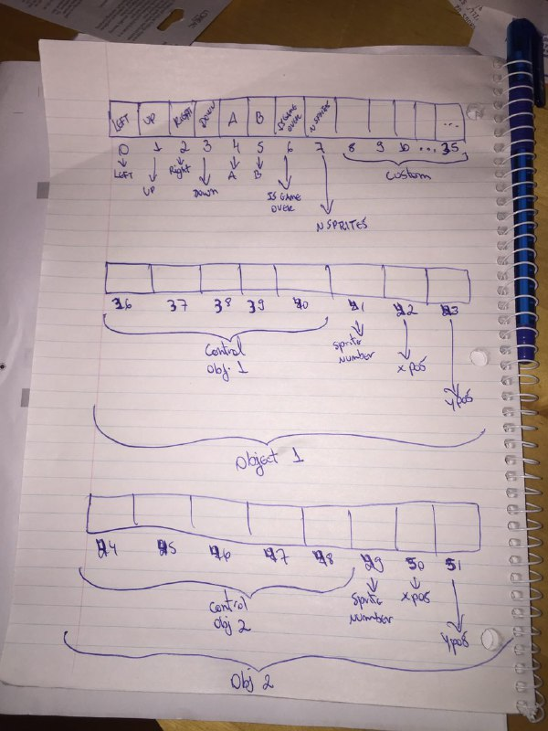

	

# BrainStation
Perhaps the smallest full-working video game console for Arduino. BrainStation is a proof of concept for the [Brainduino interpreter](https://github.com/brain-labs/brainduino)

### Status
In development mode, please check the [dev branch](https://github.com/brain-labs/brainstation/tree/dev)

### Installation
You can follow the instructions given here: [https://github.com/brain-labs/brainduino](https://github.com/brain-labs/brainduino)

### How does it work
BrainStation is based on old video game consoles such as NES and SNES and has its own PPU (Picture Processing Unit). That being said, the Arduino will follow some steps:

- Check for external user input and set the `cells 0 trough 5`, if they are active.
- Run the Brainduino as the CPU cycle (setting the values of the fields).
- Run the BrainStation as the PPU cycle (drawing the elements on the LCD).

The BrainStation uses the Brainduino cells (__100 cells__ because of the Arduino __limitation__) as its _Turing Tape_ and has this format:

__Control Cells__
- __Cell 0__: Left Button
- __Cell 1__: Up Button
- __Cell 2__: Right Button
- __Cell 3__: Down Button
- __Cell 4__: A Button
- __Cell 5__: B Button
- __Cell 6__: IsGameOver? (__0: false__, __1: true__)
- __Cell 7__: NSprites (Number of objects shown at same time on LCD)

__Custom Cells__
- __Cells 8 through 35__: Custom Cells (You can use them for any kind of operation)

__Object 1 Cells__
- __Cells 36 through 40__: Operations for the __first object__
- __Cell 41__: The sprite number of the object 1 at a given point (values are 0 through 7 because of the LCD limitation)
- __Cell 42__: X Position of object 1
- __Cell 43__: Y Position of object 1

__Object 2 Cells__
- __Cells 44 through 48__: Operations for the __second object__
- __Cell 49__: The sprite number of the object 2 at a given point (values are 0 through 7 because of the LCD limitation)
- __Cell 50__: X Position of object 2
- __Cell 51__: Y Position of object 2

Obs.: From the __Cell 36__ on, __every 8 cells represent a new object__.
Obs.2: The BrainStation has a maximum of 7 objects because of the Arduino and LCD limitations.

	

